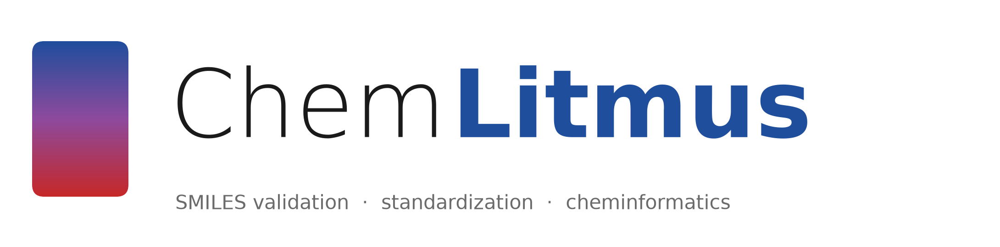

# ChemLitmus

  

**ChemLitmus is a command-line tool and Python library for checking, cleaning, comparing and auditing small-molecule data.** It answers the questions that come up before any modelling or screening can be trusted:

- *Is this SMILES valid — and if not, where exactly is it broken?*
- *Are these two records the same compound, or a salt, tautomer or stereoisomer of each other?*
- *What changed between these two releases of a compound library?*
- *Is this structural-alert catalogue actually sound, or full of dead and redundant rules?*
- *Will my PAINS screen give the same answer tomorrow, on another machine?*

Everything runs offline on RDKit except the explicitly network-backed database commands. Every result is a typed Pydantic model, every batch command writes CSV, and every command has a stable exit code so it can guard a pipeline.

## Where to start

- **New here?**

    ---

    Install in one line and run your first checks in five minutes.

    [:octicons-arrow-right-24: Getting started](getting-started/installation.md)

- **Have a task in mind?**

    ---

    Step-by-step guides for cleaning a library, auditing alert sets, comparing releases, and more.

    [:octicons-arrow-right-24: Guides](guides/clean-a-library.md)

- **Need the exact option?**

    ---

    Every command, every flag, every output column, every Python function.

    [:octicons-arrow-right-24: CLI reference](reference/cli.md)

- **Want to know why?**

    ---

    The ideas behind identity levels, molecule preparation and SMARTS auditing — and their limits.

    [:octicons-arrow-right-24: Concepts](concepts/molecular-identity.md)

## Command map

| I want to… | Command | Offline |
|---|---|---|
| Check whether a SMILES is valid | [`validate`](reference/cli.md#validate) | yes |
| Find out *why* a SMILES is invalid, and fix it | [`diagnose`](reference/cli.md#diagnose) | yes |
| Strip salts, neutralise, canonicalise tautomers | [`standardize`](reference/cli.md#standardize) | yes |
| Decide whether two records are the same compound | [`identity`](reference/cli.md#identity) | yes |
| Compare two compound collections | [`diff`](reference/cli.md#diff) | yes |
| Audit a SMARTS / structural-alert set | [`smartsaudit`](reference/cli.md#smartsaudit) | yes |
| Screen for drug-likeness and PAINS | [`filter`](reference/cli.md#filter) | yes |
| Search by substructure or similarity | [`substructure`](reference/cli.md#substructure), [`similar`](reference/cli.md#similar) | yes |
| Compute fingerprints | [`fingerprint`](reference/cli.md#fingerprint) | yes |
| Enumerate tautomers, analyse stereo, extract scaffolds | [`tautomers`](reference/cli.md#tautomers), [`stereo`](reference/cli.md#stereo), [`scaffold`](reference/cli.md#scaffold) | yes |
| R-group decomposition, atom mapping, SMILES augmentation | [`rgroup`](reference/cli.md#rgroup), [`atommap`](reference/cli.md#atommap), [`augment`](reference/cli.md#augment) | yes |
| Generate 2D/3D structures and conformers | [`download --gen all`](reference/cli.md#download), [`conformers`](reference/cli.md#conformers) | yes |
| Validate a reaction SMILES | [`reaction`](reference/cli.md#reaction) | yes |
| Get InChI / InChIKey / formula | [`iupacname`](reference/cli.md#iupacname) | yes (name needs `--online`) |
| Look up a compound across PubChem, ChEMBL, ChEBI, KEGG | [`resolve`](reference/cli.md#resolve) | **no** |
| Measure name→structure agreement between databases | [`concordance`](reference/cli.md#concordance) | **no** |
| Look up a compound in PubChem (cached) | [`lookup`](reference/cli.md#lookup), [`batch`](reference/cli.md#batch) | **no** |
| Download structures from PubChem | [`download`](reference/cli.md#download) | **no** (unless `--gen all`) |

## Design in one paragraph

Most cheminformatics tooling assumes the input is clean and the filters are right. ChemLitmus is built for the step before that. Its three distinctive capabilities — located SMILES diagnosis, layered molecular identity, and static-plus-empirical auditing of SMARTS catalogues — exist because, in practice, inputs are not clean and filters are not right, and the only way to know is to measure. Read the [concepts](concepts/molecular-identity.md) section for what each one does and, just as importantly, what it cannot tell you.

## Licence and citation

ChemLitmus is MIT-licensed. The bundled reference library is derived from ChEMBL and is redistributed under CC BY-SA 3.0 — see [Data and licensing](project/data-and-licensing.md). To cite the software, see [Citing](project/citing.md).
